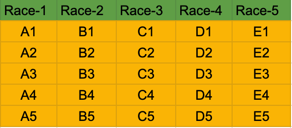
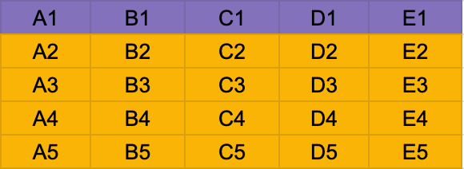
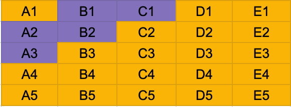

# 25 Horses

### RACE Amongst the 25 horses

Divide the 25 horses into groups of 5 and make them race. So you will have 5 races and the groups to be something like the one in the following image

Here you can see, that we have marked the groups A, B, C, D, E and the positions of each horses in the group accordingly. A1 is the fastest in the group A and A5 is the slowest, similarly B1 is the fastest in the group B and B5 is the slowest and so on.

### RACE Amongst the fastest horses

Now you have the fastest horses of each group, but you don't know which group horse is fastest. So what you will do is race the first position horse of each group and make them race. So you will end up with something like the following image

Here you can see that A1, B1, C1, D1, E1 were raced together. Suppose that the order was A1 > B1 > C1 > D1 > E1 for simplicity. So basically we can conclude that A1 is the fastest amongst all the horses. So till now we have 5 races from previous one and this race, which makes it a total of 6 races.

### Race for position 2 and 3

Now since you have the fastest horse to be A1, we can keep him aside and focus on who can be eligible for the position 2 and 3. Now from group A, A2 and A3 are possible as they are slower than A1, but can be faster than from the horses of B group. Similarly, from B group, B1 and B2 are the only contenders for position 2 and 3 because A1 is faster than B1. Similarly from C group only C1 is the contender for position 3 as A1 is greater than B1 and B1 is greater than C1.

So basically after a total of 7 races, we have the fastest 3 horses.

[Question](question.md)

[Back to Main Page](../../README.md)
